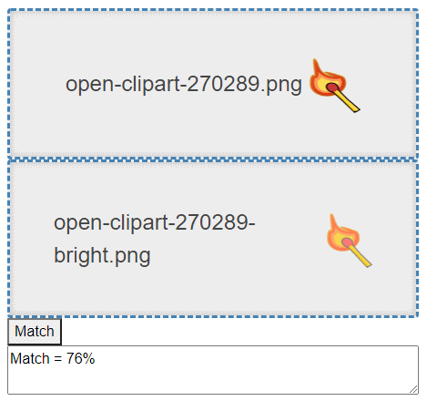

# Image Match
A simple method to compare images



Description from the [underlying method](https://github.com/ukushu/ImgComparator.git):
```text
Here is realized simple idea to comare images to find similar.

It's generate 256 bit image hash: Change img size to 16x16px(by default, but you can change size)
and reduce colors to black/white (which equals true/false in this console output)

This give you ability to find duplicates/similar images.
```

# Features
* runs on .NET Core
* runs in browser with webassembly
* commandline client

# Demo
[ImageMatch](https://trevordarcyevans.github.io/ImageMatch/)

# Prerequisites
* .NET Core 6
* Windows

# Getting started

<details>

```bash
git clone https://github.com/TrevorDArcyEvans/ImageMatch.git
cd ImageMatch/
dotnet restore
dotnet build
```

## Web UI
```bash
cd cd ImageMatch.UI.Web/
dotnet restore
dotnet build
dotnet run
```
open [ImageMatch](http://localhost:5229)

</details>

# Discussion

<details>
There are several reference images:

<details>
  <summary>Baseline</summary>


</details>

<details>
  <summary>Baseline + brightness & contrast changed</summary>


</details>

<details>
  <summary>Baseline + resized 80%</summary>


</details>

<details>
  <summary>Baseline + rotated slightly</summary>


</details>

<details>
  <summary>Baseline + rotated more</summary>


</details>

| Image                 | Match |
|-----------------------|-------|
| brightness & contrast | 78%   |
| resized               | 95%   |
| rotated slightly      | 90%   |
| rotated more          | 54%   |

The underlying algorithm is to reduce the image to a 16x16 black and white image and hope that
any small differences are absorbed in the discretisation.

However, radically altering brightness and contrast will force more pixels to white (or black)
thereby giving a lower match for the exact same image.

Similarly, large rotations will mean transformed pixels will be moved to other discretisation
blocks, again resulting in a lower match.

</details>

# Further work
* possibly use discreet wavelet transform to improve matching

# Further information
* [Algorithm to compare two images](https://stackoverflow.com/questions/23931/algorithm-to-compare-two-images)

# Acknowledgements
* [ImageComparator](https://github.com/ukushu/ImgComparator.git)
